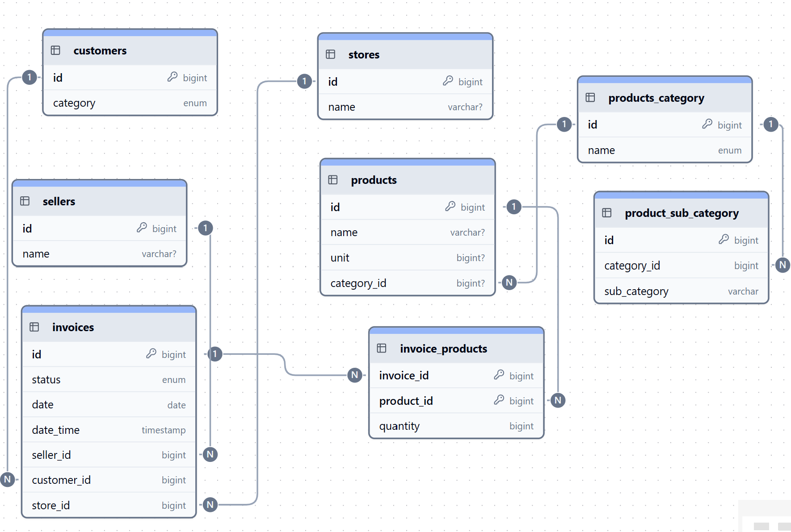

# Sales Data Analysis Project

## Database Schema

Below is the image showing the database schema used in this project:



---

## Getting Started

1. Run the SQL file located in the `database` folder on your MySQL server. This will create the database and all necessary tables.

2. Install the required Python packages by running:

    ```bash
    pip install -r requirements.txt
    ```

3. Update the database connection parameters in the Python script (`etl.py`) to match your environment:

    ```python
    # DB Connection
    conn = mysql.connector.connect(
        host='localhost',
        user='your_username',
        password='your_pass',
        database='sale_db'
    )
    ```

4. Run the Python script to load the sample sales data into the database.
---

To better visualize and analyze the reports, install **Power BI** and open the provided Power BI workspace file (`.pbix`).
